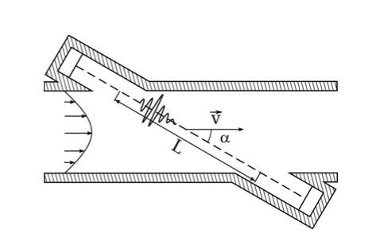

# UltrasoundFlow

It's projekt for gas flow measurement with usage of ultrasound wave propagation time. It use 2 Input Capture Unit of 2 16-bit Timers/Couters on Input Capture Pin to rising edge of signal. Rising edge is from amplifire of piezoelectric membrane witch is reciving ultrasound wave from another piezoelectric memgrane witch is working as transmitter. Transmited signal come from cyclic interruption, wher signal is set to high for 25 ms (40hz).

# Teory bechind idea

* volumetric flow rate - Q
* flow velocity - $\vec{V}$
* cross-section of medium - $\vec{A}$

$$ Q=\vec{V}*\vec{A}\tag{1}$$
$$ [\frac{m^{3}}{s}=\frac{m}{s}*m^2]\tag{2}$$



* afective velocity of the ultrasound wave in flow of medium - $\vec{V}_{ef}$
* velocity of propagation of ultrasonic wave in a given medium - $\vec{c}$
* flow volocity of medium - $\vec{V}$
$$ \vec{V}_{ef}=\vec{V}+\vec{c} \tag{3}$$
Velocity can be obtain by measure timings of ultrasound wave propagation in the same direction and in the oposit direction of velociety of the medium. 

* angel between velocity of medium $\vec{V}$ and velocity of the ultrasonic wave  $\vec{c}$ - $\alpha$
* distande of propagation of ultrasonic wave thru a medium - L
* time of propagation in the same direction of velocity of the medium - ${t}_{1}$
* time of propagation in the oposit direction of velocity of the medium - ${t}_{2}$

$${t}_{1}=\frac{L}{c+\vec{V}sin\alpha}\tag{4}$$
$${t}_{2}=\frac{L}{c-\vec{V}sin\alpha}\tag{5}$$
From equasion 4 and 5 we obtain flow velocity ofg the medium
$$\vec{V}=\frac{L}{2cos\alpha}\frac{{t}_{2}-{t}_{1}}{{t}_{2}{t}_{1}}\tag{6}$$
## Implementation

Piezoelectric membranes ware used to transmit and receive ultrasounds. For the receiving membrane, an amplifier was used according to the scheme :


Comparation of signal from membrane and from amplifier (blue signal from membrane, yellow after amp) :


Signal timing chart, yellow transmitted, blue amplified received :


## Getting Started

To clone repository :
```
git clone https://github.com/szalalala/UltrasoundFlow.git
```
Repository contage a ready to upload project for Arduino Mega 2560.
